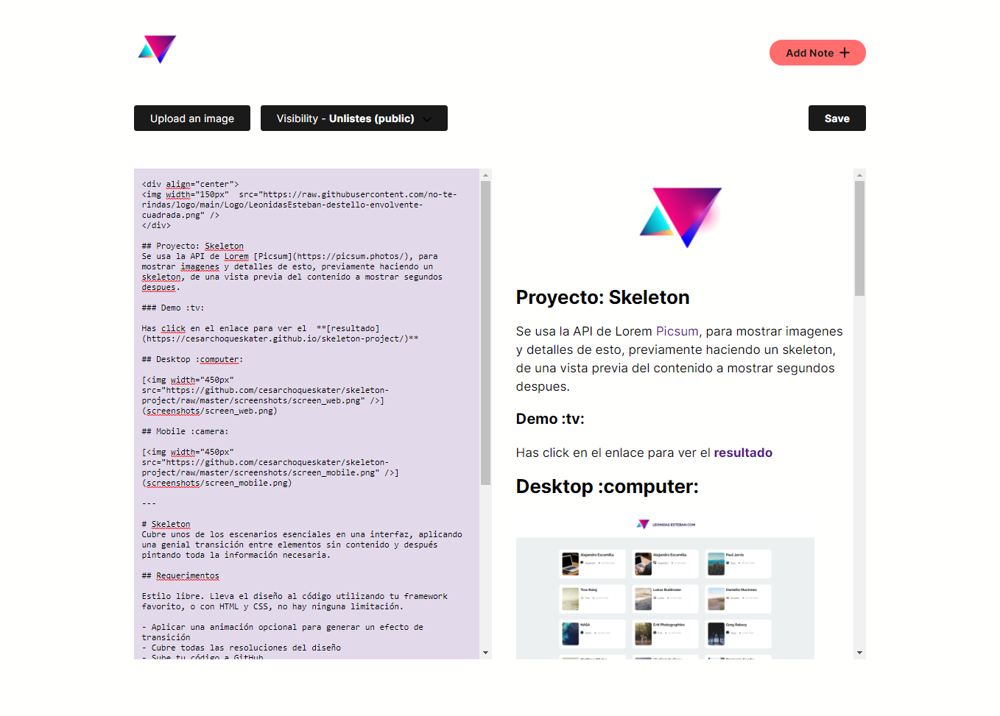
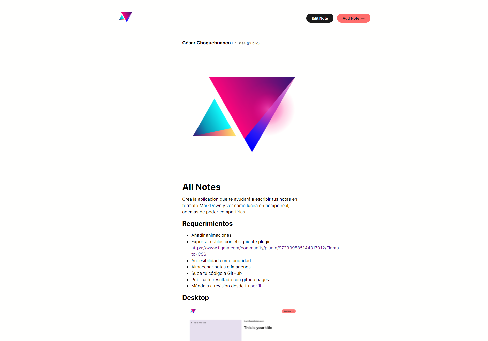

# All Notes

Este proyecto consiste en recrear una aplicación que ayudara a escribir tus notas en formato MarkDown y ver como lucirá en tiempo real, además de poder compartirlas.

Me gusto mucho hacer este proyecto, fue muy retador para mi, en muchos aspectos, aprendi muchas cosas en el camino, y lo mas importante es que pude poner en practica lo aprendido. :)

| Acciones   |  |
| ------ | ------   |
| Crea, edita y elimina notas |   :heavy_check_mark:  |
| Convierte tus notas en formato Markdown |  :heavy_check_mark:   |
| Agrega imagenes, en formato data:image/base64 |  :heavy_check_mark:   |

Las tecnologias usadas son las siguientes:

* HTML, CSS y Javascript
* [Marked.js](https://marked.js.org/)
* Markdown

## Requerimientos

- Añadir animaciones
- Exportar estilos con el siguiente plugin: https://www.figma.com/community/plugin/972939585144317012/Figma-to-CSS
- Accesibilidad como prioridad
- Almacenar notas e imagénes.
- Sube tu código a GitHub
- Publica tu resultado con github pages
- Mándalo a revisión desde tu [perfil](https://leonidasesteban.com/estudiante)

### Demo :computer:

Has click en el enlace para ver el  **[resultado](https://cesarchoqueskater.github.io/all-notes-project/)** 

### Imagenes :camera:

#### Mobile

  <table>
   <tr>
    <td style="text-align:center">
        
    </td>
    <td style="text-align:center">
        
    </td>
    <td style="text-align:center">
        
    </td>
     <td style="text-align:center">
        
        </td>
  </table>
 

#### Desktop

----------

## Disclaimer

Todas son propuestas, el propósito de **/Proyectos** es brindarte el diseño, el límite de la creación lo dictan tus ganas de hacerlo realidad y tu skills del momento a la hora de codear.

## Nivel 1

Estilo libre. Lleva el diseño al código utilizando tu framework favorito, o con HTML y CSS, no hay ninguna limitación.

Requerimientos

- Accesibilidad como prioridad
- Sube tu código a GitHub
- Publica tu resultado con github pages
- Mándalo a revisión desde tu [perfil](https://leonidasesteban.com/estudiante)

## Nivel 2

Guarda las notas y las imagénes, para poder consultarlas en cualquier otro momento.

## Nivel 3

Publicación, permite publicar las notas en un sitio estático para que cualquier persona pueda leerlas.

Requerimientos

- Accesibilidad como prioridad
- Permitir publicación de las notas.
- Sube tu código a GitHub
- Publica tu resultado con github pages
- Mándalo a revisión desde tu [perfil](https://leonidasesteban.com/estudiante)

## Créditos

Encuentra más proyectos asombrosos en [/Proyectos](https://leonidasesteban.com/proyectos)

Diseñado con ♥️ en leonidasesteban.com
